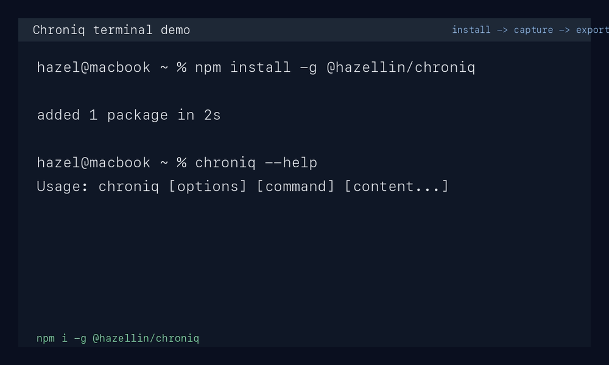

# Chroniq

[中文文档](./README.zh-CN.md)

Chroniq is a local-first, CLI-first, agent-friendly personal logging tool.

It is built for one narrow job: capture lightweight notes quickly, keep them append-only, and make them easy for both humans and agents to consume.

It intentionally does not try to become a full journaling app, knowledge base, or review system.

Published package: `@hazellin/chroniq`

Installed binaries: `chroniq`, `cq`



## Why

- Fast input over heavy structure
- Local files over cloud dependency
- JSON output over opaque app state
- Agent-friendly workflows over GUI-first interaction

## Features

- Add notes from the terminal with `chroniq add` or `cq add`
- Save one multi-line note with `chroniq add --multiline` or `cat note.md | chroniq add --stdin`
- Interactive `chroniq add --stdin` automatically opens your editor, so multi-line content stays editable before save
- Split one input block into multiple notes with `chroniq add --split`
- Read today's notes with `cq today`
- Browse stored dates with `cq list`
- Export all entries as JSON with `cq export`
- Store data in append-only `jsonl` files
- Keep output readable for humans and stable for scripts

## Installation

### From npm

```bash
npm install -g @hazellin/chroniq
chroniq --help
```

Or with pnpm:

```bash
pnpm add -g @hazellin/chroniq
cq today
```

### From source

```bash
pnpm install
pnpm build
pnpm link --global
```

After installation, `chroniq` and `cq` are available in your shell.

### Local development

```bash
pnpm install
pnpm check
pnpm build
node ./dist/cli.js --help
```

## Usage

### Input modes

- `chroniq add`: line-oriented input. One line becomes one record.
- `chroniq add --stdin`: block-oriented input. The whole input block becomes one record unless you also pass `--split`.

### Add an entry

```bash
cq add "I want my logging flow to stay CLI-first"
cq add                       # multi-line input -> multiple records
cq add --stdin               # multi-line input -> one record
cq add "Build for agents should be the default" --tag thought
cq add "Discussed personal logging schema" --tag idea work
cq add "One line with inline tag #idea"
cq add --multiline
chroniq add --stdin
cat note.md | cq add --stdin
cat tasks.txt | cq add --stdin --split auto
```

If you use inline `#tags` in your shell command, keep the whole content in quotes. Otherwise your shell treats `#...` as a comment before Chroniq sees it.

Example output:

```text
Recorded: Build for agents should be the default
File: /path/to/chroniq/data/logs/2026-03-10.jsonl
ID: 20260310121030-123
```

### Read today's entries

```bash
cq today
cq today --json
cq today --full
```

### List dates or inspect a specific date

```bash
cq list
cq list --date 2026-03-10
cq list --date 2026-03-10 --json
cq list --date 2026-03-10 --full
```

### Export all entries

```bash
cq export
cq export --format json
```

## Data Format

Entries are stored by day under:

```text
data/logs/YYYY-MM-DD.jsonl
```

Each line is one JSON object:

```json
{
  "id": "20260310121030-123",
  "content": "I want my logging flow to stay CLI-first",
  "created_at": "2026-03-10T04:10:30.123Z",
  "source": "cli",
  "tags": ["thought"],
  "type": "note"
}
```

This format is intended to be:

- Easy to append
- Safe to parse line by line
- Friendly to shell tools, scripts, and LLM or agent pipelines

## Agent Usage

Typical agent-friendly flow:

```bash
cq add "Discussed CLI input design for personal logging" --tag idea
cq today --json
cq export --format json
```

That makes downstream classification, summarization, or indexing straightforward.

## Project Scope

Current scope:

- lightweight capture
- simple retrieval
- stable local storage
- machine-readable export

Out of scope for now:

- automatic categorization
- review workflows
- full-text search engine
- sync service
- GUI app

## Development

Scripts:

```bash
pnpm dev
pnpm build
pnpm check
```

Project layout:

```text
bin/        executable wrapper
src/        TypeScript source
dist/       compiled output
data/logs/  local append-only log files
```

## Contributing

Issues and pull requests are welcome.

Before opening a PR:

- keep the tool local-first and CLI-first
- avoid turning simple capture into a heavy workflow engine
- preserve stable JSON output for agent use
- run `pnpm check` and `pnpm build`

See [CONTRIBUTING.md](https://github.com/Hazel-Lin/chroniq/blob/main/CONTRIBUTING.md) for details.

## Security and Privacy

Chroniq stores entries as local plain-text JSONL files. Do not use it for secrets unless your local machine and repository workflow are already set up for that risk.

See [SECURITY.md](https://github.com/Hazel-Lin/chroniq/blob/main/SECURITY.md).

## Release

Maintainer release flow:

```bash
pnpm install
pnpm release:check
npm publish --access public
```

See the [npm release checklist](https://github.com/Hazel-Lin/chroniq/blob/main/docs/npm-release.md) and the [launch kit](https://github.com/Hazel-Lin/chroniq/blob/main/docs/go-to-market/launch-kit.md).

## License

MIT. See [LICENSE](./LICENSE).
